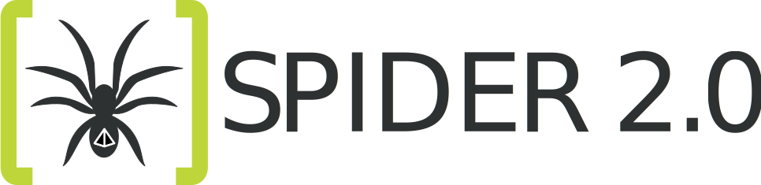

# 
_Synchronous Parameterized and Interfaced Dataflow Embedded Runtime_


SPIDER _\[spaɪdə\]_ is an open-source Dataflow based runtime for running signal processing applications based on the [Parameterized and Interfaced Based Synchronous Dataflow (PiSDF)](https://hal.inria.fr/hal-00877492) model.
The purpose of this runtime is to provide rapid-prototyping capabilities to developpers to see how much parallelism they can leverage from their applications.
The framework is developped as a C++ shared library and use as much as possible standard features of the language in order to provide stable experience on different platforms.
Any compiler compliant with the C++11 standard should be able to compile the Spider 2.0 library.

Spider 2.0 is developped at the Institute of Electronics and Telecommunications-Rennes (IETR).

## Overview

* [Build and Install Spider 2.0](#build-and-install-spider-2.0)

* [How to Use the Spider 2.0 Library](#how-to-use-the-spider-2.0-library)

* [Contact](#contact)

* [License](#license)

## Build and Install Spider 2.0

## Build tools

The build process of SPIDER 2.0 relies on [cmake](https://cmake.org) to configure a project for a wide variety of development environments and operating systems. Install [cmake](https://cmake.org/download/) on your system before building the library.

The SPIDER 2.0 code is annotated with the [doxygen](http://www.doxygen.nl/) syntax.  Install [doxygen](http://www.doxygen.nl/download.html) on your system if you want to build the documentation of the library.

### Compiling SPIDER 2.0

To build the shared library, a variety of scripts are provided.

* Building SPIDER 2.0 shared library on Linux using GCC:
```shell
git clone https://github.com/preesm/spider-2.0.git
cd spider-2.0/libspider/build-scripts/linux
./CMakeGCC.sh
```

* Building SPIDER 2.0 shared library on Linux using CodeBlock:
 ```shell
 git clone https://github.com/preesm/spider-2.0.git
 cd spider-2.0/libspider/build-scripts/linux
 ./CMakeCodeblock.sh
 ```

* Building SPIDER 2.0 shared library on Windows using CodeBlock:
  ```shell
  git clone https://github.com/preesm/spider-2.0.git
  cd spider-2.0/libspider/build-scripts/windows
  ./CMakeCodeblock.bat
  ```

* Building SPIDER 2.0 shared library on Windows using Visual Studio 2017:
   ```shell
   git clone https://github.com/preesm/spider-2.0.git
   cd spider-2.0/libspider/build-scripts/windows
   ./CMakeVS2017.bat
   ```

### System wide installation

* Linux platforms:
   ```shell
   PREFIX=/usr/local/
   sudo cp libSpider2.0.so  ${PREFIX}/lib/
   sudo cp libspider/spider-api/*.h ${PREFIX}/include/
   ```

* Windows platforms:

__(coming soon...)__


### Generating the Doxygen documentation

__(coming soon...)__

## How to Use the Spider 2.0 Library

__(coming soon...)__


## Contact

This project is maintained by the Preesm maintainers. Contact us using one of the following:

*   General information : contact@preesm.org
*   Technical support : https://github.com/preesm/spider/issues

## License

This project is distributed under the CeCILL-C license (see [LICENSE file](LICENSE)).
