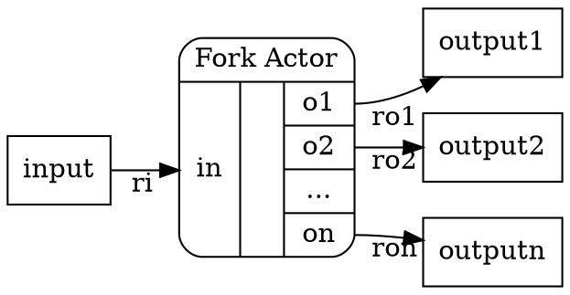
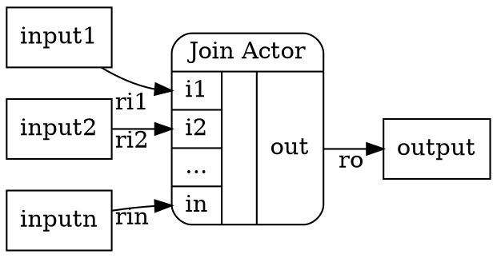
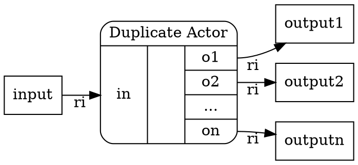
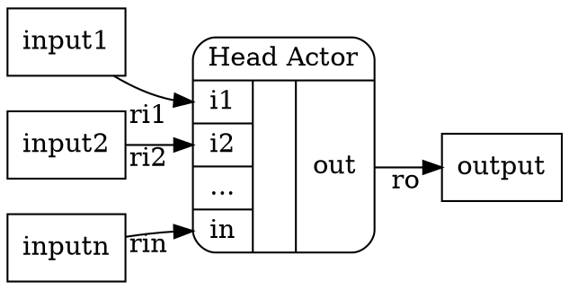
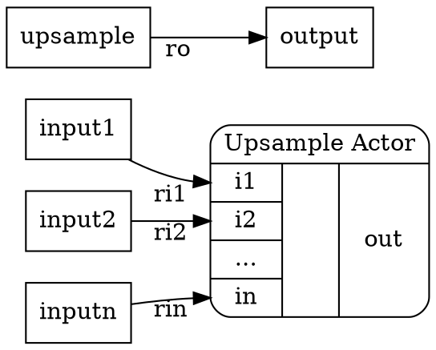

Spider 2.0: Special actors classification
=================

Abstract: Preesm and Spider 2.0 offers special actors as "syntaxic sugar" to help developers
manipulate data transfer in a PiSDF graph. The semantic of these actors is not necessarly the
same between Preesm and Spider 2.0. However, the automatic codegeneration of Preesm to Spider 2.0 
will convert the special actors of Preesm into the special actors of Spider 2.0.
This document lists the special actors of Spider 2.0 and their expected runtime and memory behavior.

#### Fork

*    1 input
*    n outputs
*    rates: in_rate == sum(out_rates)
*    memory behavior: input tokens are split in order of the output ports and w.r.t output rates
*    input is READ_ONLY
*    outputs are WRITE_ONLY

#### Join

*    n inputs
*    1 output
*    rates: out_rate == sum(in_rates)
*    memory behavior: input tokens are merged in order of the input ports and w.r.t input rates
*    inputs are READ_ONLY
*    output is WRITE_ONLY

#### Duplicate

*    1 input
*    n outputs
*    rates: in_rate == out_rate, for every output
*    memory behavior: input tokens are duplicated on each output.
*    input is READ_ONLY
*    outputs are WRITE_ONLY

#### Tail

*    n inputs
*    1 output
*    rates: out_rate <= sum(in_rates)
*    memory behavior: output the last ro tokens produced on its input in order of production.
*    inputs are READ_ONLY
*    output is WRITE_ONLY

#### Head

*    n inputs
*    1 output
*    rates: out_rate <= sum(in_rates)
*    memory behavior: output the first ro tokens produced on its input in order of production.
*    inputs are READ_ONLY
*    output is WRITE_ONLY

#### Repeat

*    1 input
*    1 output
*    rates: out_rate >= in_rate
*    memory behavior: Repeat the input tokens on its output in the order of production.
*    input is READ_ONLY
*    output is WRITE_ONLY

